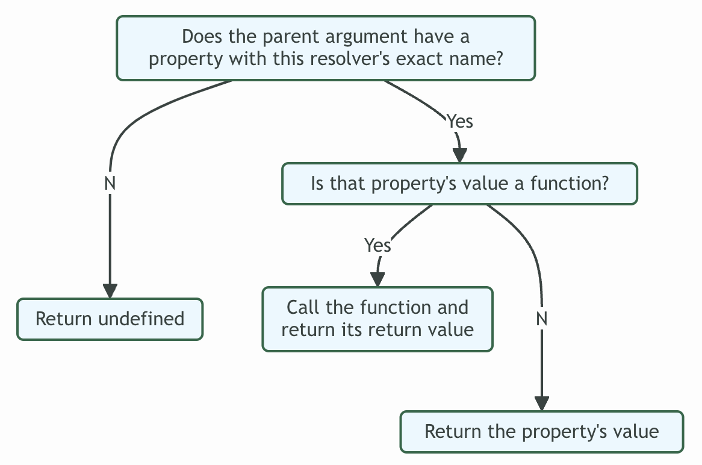

# Resolver

Apollo Server needs to know how to populate data for every field in your schema so that it can respond to requests for that data.

- The resolver map has top-level fields that correspond to your schema's **types** (such as Query).
- Each resolver function belongs to whichever type its corresponding **field** belongs to.
- Resolver Chain: Query.books -> Book.author -> Author.name -> ...

## Arguments

| Argument     | Description                                                |
| ------------ | ---------------------------------------------------------- |
| parent       | The previous resolver in the resolver chain                |
| args         | An object that contains all arguments for this field       |
| contextValue | An object shared across all resolvers                      |
| info         | Contains information about the operation's execution state |

- Contet Value: Use this to share per-operation state, including authentication information, dataloader instances, and anything else to track across resolvers.
- Info: Contains information about the operation's execution state, including the field name, the path to the field from the root, and more.

## Return

- Scalar / object
- Array
- null / undefined
- Promise
